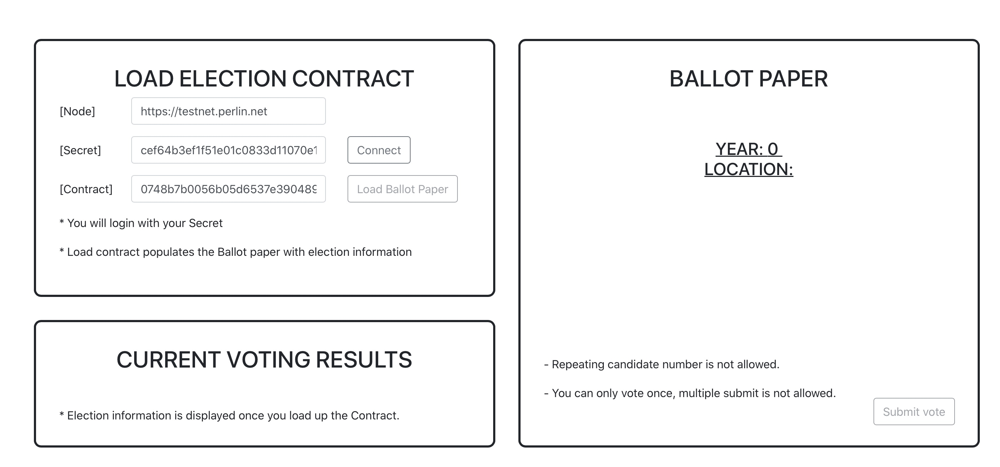
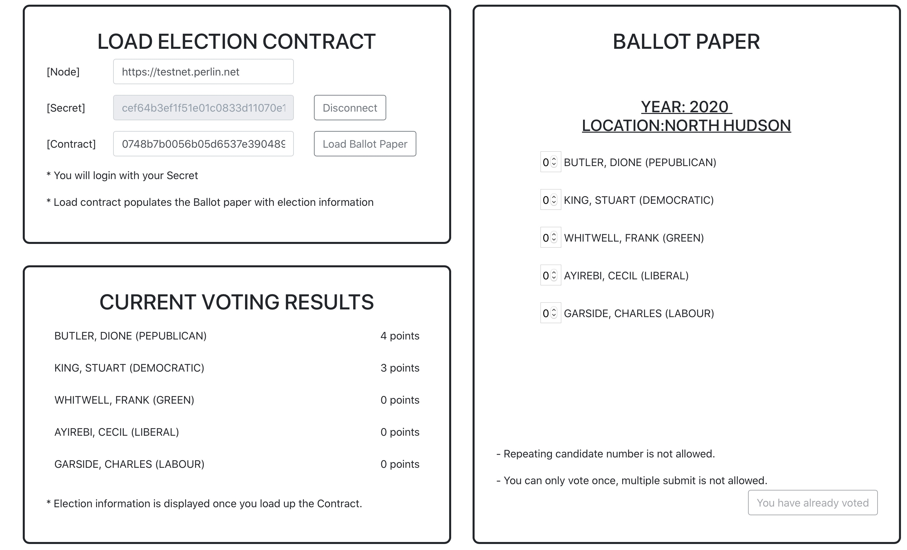
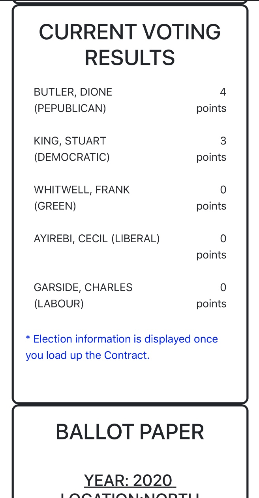

# Description

This is my solution of my solution to the Blockchain Challenge on 2hats. 

Backend: Rust
Frontend: Reactjs + Webassembly

## Struct Backend

```
cd backend
cargo build --release --target=wasm32-unknown-unknown
```

## Struct Frontend
The UI design simply uses React-Bootstrap to guarantee the layout. The self-adaption for mobile is made as well. 
```
cd frontend
npm install
npm run serve
```
## Preview
### Before connect


### After connect


### Mobile

